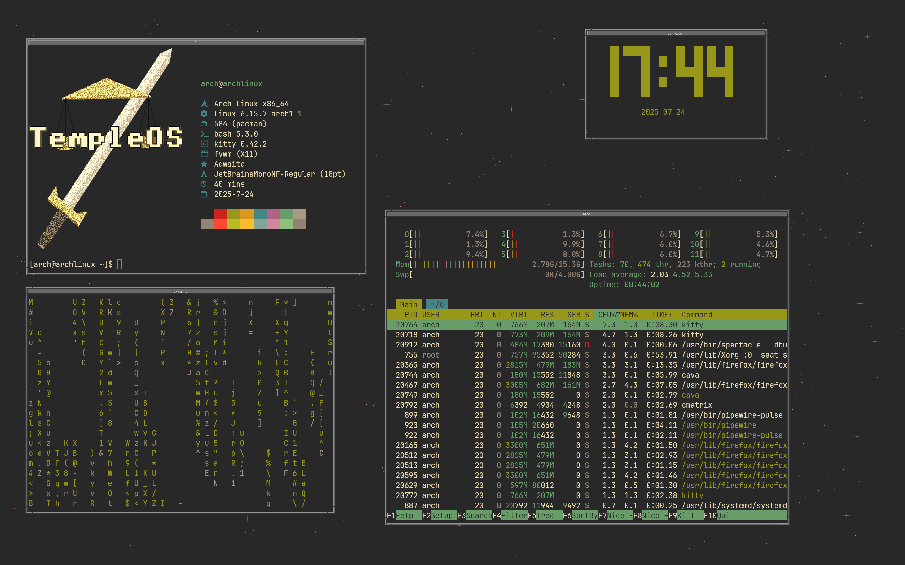

# Arch Linux Rice

A TempleOS inspired rice for **Arch Linux** using **FVWM**.

---

## System

- **OS**: Arch Linux  
- **WM**: FVWM  



---

## Software
 
- [cava](https://github.com/karlstav/cava) – console-based audio visualizer  
- [terminal-rain](https://github.com/rmaake1/terminal-rain-lightning) – rain in the terminal
- [cmatrix](https://github.com/abishekvashok/cmatrix) – matrix in the terminal  
- [tty-clock](https://github.com/xorg62/tty-clock) – terminal digital clock  
- [nitch](https://github.com/ssleert/nitch) – system information tool  
- [fastfetch](https://github.com/fastfetch-cli/fastfetch) – fast system info tool  
- [rofi](https://github.com/davatorium/rofi) – application launcher   
- [kitty](https://github.com/kovidgoyal/kitty) – GPU-based terminal emulator  
- [nitrogen](https://github.com/l3ib/nitrogen) – wallpaper setter  
- [htop](https://github.com/htop-dev/htop) – system monitor
- [chafa](https://github.com/hpjansson/chafa) – terminal image viewer
---

## Fonts

- JetBrains Mono Nerd Font  

---

## Setup Guide

To use this rice on a fresh Arch Linux install, follow these steps:

### Use installation script

```bash
wget https://raw.githubusercontent.com/ShadowNetter-Official/Arch-Rice-July-2025/main/install.sh && sh install.sh
```
### Or install manually:

### 1. Install Required Packages

```bash
sudo pacman -S kitty lightdm-gtk-greeter ttf-jetbrains-mono-nerd firefox rofi fastfetch python-pipx htop cmatrix nitrogen chafa
```
### 2. Install YAY (AUR Helper)

```bash
git clone https://aur.archlinux.org/yay-git.git
cd yay-git
makepkg -si
cd ~/
```
### 3. Install Required Packages With YAY

```bash
yay -S fvwm fvwm-themes fvwm-themes-extra fvwm-crystal fvwm-icons cava tty-clock
```

### 4. Clone This Repo

```bash
git clone https://github.com/ShadowNetter-Official/Arch-Rice-July-2025.git
cd Arch-Rice-July-2025
```

### 5. Configure FVWM and Other Tools

```bash
mkdir ~/.config/rofi
mkdir ~/.config/fastfetch
mkdir ~/wallpapers
mkdir ~/.config/kitty
cp config/fvwm/config ~/.fvwm/
rm ~/.bashrc
cp config/bashrc ~/.bashrc
cp config/fastfetch/* ~/.config/fastfetch/
cp wallpapers/* ~/wallpapers/
cp config/kitty/kitty.conf ~/.config/kitty/
cp config/rofi/config.rasi ~/.config/rofi/
sudo systemctl enable lightdm.service
pipx install git+https://github.com/rmaake1/terminal-rain-lightning.git
wget https://raw.githubusercontent.com/unxsh/nitch/main/setup.sh && sh setup.sh
```

### 6. Done :)

you can now reboot your system

### MIT License

Copyright (c) 2025 ShadowNetter-Official

Permission is hereby granted, free of charge, to any person obtaining a copy
of this software and associated documentation files (the "Software"), to deal
in the Software without restriction, including without limitation the rights
to use, copy, modify, merge, publish, distribute, sublicense, and/or sell
copies of the Software, and to permit persons to whom the Software is
furnished to do so, subject to the following conditions:

The above copyright notice and this permission notice shall be included in all
copies or substantial portions of the Software.

THE SOFTWARE IS PROVIDED "AS IS", WITHOUT WARRANTY OF ANY KIND, EXPRESS OR
IMPLIED, INCLUDING BUT NOT LIMITED TO THE WARRANTIES OF MERCHANTABILITY,
FITNESS FOR A PARTICULAR PURPOSE AND NONINFRINGEMENT. IN NO EVENT SHALL THE
AUTHORS OR COPYRIGHT HOLDERS BE LIABLE FOR ANY CLAIM, DAMAGES OR OTHER
LIABILITY, WHETHER IN AN ACTION OF CONTRACT, TORT OR OTHERWISE, ARISING FROM,
OUT OF OR IN CONNECTION WITH THE SOFTWARE OR THE USE OR OTHER DEALINGS IN THE
SOFTWARE.
